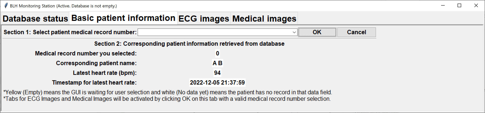

# Final project: Patient Monitoring System 


## Project description 
This program is designed to build a patient monitoring system with a 
patient client, a monitoring-station client, and a server database. 
The server is 
running on http://vcm-29744.vm.duke.edu:5000

Assignment link: https://github.com/dward2/BME547/blob/main/Assignments/final_image_processor.md
* Assignment add-on link: https://github.com/dward2/BME547/blob/main/Assignments/final_project_add_on.md

HW GitHub link: https://github.com/BME547-Fall2022/final-project-blh 

## Authors: BLH team 
**Ziwei He**
* <ziwei.he974@duke.edu>
* Department of Biomedical Engineering


**Junqi Lu**
* <junqi.lu@duke.edu>
* Department of Electrical & Computer Engineering


**Ramana Balla**
* <venkataramana.balla@duke.edu>
* Department of Biomedical Engineering

## Data types and database structure
`medical_record_number` (use this as **primary key**): **int** 
* All entries in the database have at least the medical record number
* This field will be used as the primary key, so its field name will become 
  `_id` in MongoDB

An entry may or may not include the `patient_name`, measured heart rate & 
ECG image (these 2 will always be together), or medical image & medical 
image filename (these 2 will always be together). 
* `patient_name`: **str** in the format of "Firstname Lastname"
* Heart rate: `heart_rate_history` and `ecg_image_history` will be
    synchronized and new values will use the same `timestamp_str`
    * `heart_rate_history`: **dict** in the format of **{timestamp_str: 
      heart_rate_int}**
    * `ecg_image_history`: **dict** in the format of **{timestamp_str: 
      b64_str for image}**
* Medical image: `medical_filename_history` and `medical_image_history` will be
    synchronized and new values will use the same `timestamp_str`
    * `medical_filename_history`: **dict** in the format of **{timestamp_str: filename_str}**
    * `medical_image_history`: **dict** in the format of **{timestamp_str: 
      b64_str for image}**

All timestamp mentioned above will be strings in a format as `%Y-%m-%d 
%H:%M:%S`.

Together, a patient's entry in the database should have the structure as 
`{medical_record_number: int, patient_name: str, heart_rate_history: {timestmap_str: int}, ecg_image_history: {timestmap_str: b64_str},
    medical_filename_history: {timestmap_str: filename_str},
    medical_image_history: {timestmap_str: b64_str}}`

## Server routes
Overall
* `GET /`: This route simply return a string to indicate the status of the 
  server. If the server is successfully running, it will return the 
  string "Server is on"

Monitoring side
* `GET /api/monitor/database_connect_status`: This GET request check on the 
  status of the connection to a mongodb database from the server. It 
  returns jsonified str 'Successfully connected
    to the database' with status code int 200 if the database is successfully 
  connected and 'Failed
    to connect to the database' with status code 400 if not.
* `GET /api/monitor/all_med_number`: This GET request returns a jsonified 
  list of all the 
  medical record numbers from the database with a status code int 200 if the 
  database contains at least 1 patient entry or returns a jsonified list 
  `['Database is empty. Add in data from patient GUI first']` with status 
  cide 400 if the database contains is empty
* `GET /api/monitor/patient_info/<record_number>`: This GET request 
  function obtains an int record_number from the selection made by the user 
  from 
  the monitoring side GUI and use that record number to find out the 
  patient info dict in the structure as `{
    medical_record_number: int, patient_name: str, heart_rate_history: {
    timestmap_str: int}, ecg_image_history: {timestmap_str: b64_str},
    medical_filename_history: {timestmap_str: filename_str},
    medical_image_history: {timestmap_str: b64_str}}`

Patient side
* `POST /patient_GUI/upload/<warn>`: This POST request accepts patient information to upload.
  The patient information should be
    formatted as below:
        {
            "patient_record_no": <int> (mandatory)
            "patient_name": <str> (blank if not provide)
            "medical_img": <b64str> (blank if not provide)
            "img_filename": <str> (blank if not provide)
            "ECG_img": <b64str> (blank if not provide)
            "heart_rate": <str> (blank if not provide)
        }
    The <warn> parameter indicates if the user wants to overwrite data. "true"
    means overwrite. Otherwise, the parameter is "false".

## Video code demo
This video covers how the user should use the patient side GUI and monitor 
side GUI. 

Full video code demo: https://youtu.be/r78OE9yTu-o
* Intro: https://youtu.be/oCiVkeXwMsc
* Ziwei's patient side GUI: https://youtu.be/9XaaKV-k83k
* Junqi's monitoring side GUI: https://youtu.be/pCUA6sSLiGk
* Ramana's ECG monitoring (Add-on) GUI: https://www.youtube.com/watch?v=DCHVWJKm8eI
* Outro: https://youtu.be/1hgO4V0oQes

## Patient Side GUI
Author: Ziwei He

This GUI allows the user to upload patient information and analyse the ECG data.
### Usage
* Download the **patient_side_GUI.py** script from [here](https://github.com/BME547-Fall2022/final-project-blh)
* Run the script in the command line by ```python patient_side_GUI.py``` or ```python3 patient_side_GUI.py```.
* A GUI window should pop up:

There are buttons for loading medical images, analysing ECG data, uploading information, clear all information, and exiting the GUI.
* **Loading medical images**
	* Click on the "Load image" button
	* A dialogue will show up, choose the required image file
	
	* If the file is not an image file, an error window will pop up

	
	* If an image file is chosen, the file will show below the button
	
* **Analyse ECG data**
	* Click on the "ECG analysis" button and choose the data file in the file dialogue.
	* The ECG data file should be a csv file with two columns. The first column should be time in seconds and the second column should be voltage in mV. The time series should be increasing series with a duration greater than 0.38 s. The sample frequency should be at least 10 Hz. Otherwise, an error window will be prompted.
	
	* The ECG plot and the bpm will show below the button.
	
* **Upload information**
	* Click the "upload" button. The GUI will check the format of the name and record input. The name should only contain letters and spaces and the patient record number should only contain numbers. The patient record number must be provided in order to upload the information, while other information could be blank.
	
	
	
	 Error 1: Blank patient record number
	
	
	
	 Error 2: Invalid patient record number
	
	
	
	 Error 3: Invalid name
	* A summary window will pop up. Click "OK" to upload or "Cancel" to return.

	
	
	* You can update the patient information by uploading new images, ECG data, and name under the same patient record number.

	
	
	
	Example 1: Update images
	
	
	
	
	Example 2: Update name in the database
	* Sometimes you may see the error windows below. This is either because the GUI fails to connect to the server or the server can not connect to the database.
	
	  
	  
	  Error 1: Server connection failure
* **Clear and cancel**
	* You can clear all the information by clicking the "clear" button. If you want to leave the GUI, click on the cross mark or the "Cancel" button.
### Data structure and reference
* The data to be uploaded are stored in a dictionary.
```
	{
            "patient_record_no": <int> (mandatory),
            "patient_name": <str> (blank if not provide),
            "medical_img": <b64str> (blank if not provide),
            "img_filename": <str> (blank if not provide),
            "ECG_img": <b64str> (blank if not provide),
            "heart_rate": <str> (blank if not provide)
    }
```

## Monitoring Side GUI
Author: Junqi Lu

This GUI allows the uesr to query on the database, display latest heart 
rate and ECG, select ECG or medical image to display 

### Usage
To start the GUI: 
1. Download the whole project directory from 
   our 
   GitHub page: https://github.com/BME547-Fall2022/final-project-blh 
2. In Git bash window, `cd` to the local directory where you saved the **monitor_side_GUI.py**
3. Install all the required packages by `pip install -r requirements.txt`
4. Activate the virtual environment by `source venv/Scripts/activate`
5. Run the GUI by `python monitor_side_GUI.py`

For all the GUI panels below, 
* **(Empty)** with **yellow** background means the 
GUI is waiting for the user to make some selections. Before the user makes. 
  a selection, it will be in that default state
* **(No data yet)** with **white** background means the GUI has obtained the 
  data,
  but inside the database, the corresponding datafield contains no data yet. 

You will see several combobox and OK button working together as a pair. 
* User needs to make a selection in the combobox before hitting the OK 
  button. Otherwise, a warning message box will pop out, asking the user to 
  make a selection.
* After the user made a valid selection, the user will hit on OK button to 
  confirm the selection. Hitting that OK button will also clean up the 
  residual text in the combobox to avoid any potential confusions. That 
  passed in information will always be shown on some labels as a 
  confirmation on the same tab as that combobox-OK-button pair is located on. 
  * Doing this ensures what user is seeing on the GUI is the user selection 
	made to the GUI. 

Tab 1, 2, and 3 all have small hints started with * and are located on the 
very button of the tabs as labels to provide the user with some extra 
guidance. 

### Tab 0: Database status 
This tab will display message on whether the server's database is empty. 
This check will be performed every 1 sec. During the using of this 
monitoring GUI, whenver the database is empty, the user will be forced to 
return to this tab 0 with tab 1, 2, and 3 locked up. 
* If the connected database is empty, tab 1, 2, and 3 will be locked up.


* If the connected database is not empty, tab 1 will be activated for user to 
  proceed.


### Tab 1: Basic patient information
It has 2 sections:
1. Ask the user to select a record number to use to retrieve patient record 
   data from the database through the server.
2. Display the selected patient record number, patient name, latest heart 
   rate and its timestamp.

Once the tab 1 is activated as the database is not empty, user can make a 
selection on the record number combobox. The combobox for the user to select 
medical 
reocrd number will be dynamically updated. 


OK button:
* If clicked without making a selection, a message box will pop out asking 
  the 
  user for a selection 


* If clicked with a selection for medical record number, data fields in 
  section 2 will be updated. These data fields will be dynamically updated 
  with the latest data obtained from the database. Also tab 2 and 3 will be 
  activated. 




Cancel button: if clicked, it asks user whether you want to leave the GUI. 
If the user click Cancel then nothing will happen; if click on OK, then the 
user will quit GUI. 


### Tab 2: ECG images
It has 3 sections:
1. Automatically display the latest ECG image and its timestamp.
2. Ask user to select and display an ECG image from the ECG records by 
   timestamp.
3. Ask user which ECG image to download.

Once tab 2 is activated by tab 1's OK button with a valid record number, it 
will dynamically update the latest ECG image from the ECG history for every 
1 sec in section 1.


Section 2 will wait for the user to make a selection on which ECG image to 
display. After clicking on OK with a valid selection from ECG history 
combobox, the corresponding ECG and its timestamp will 
be displayed. The combobox for selecting ECG will be cleaned to avoid 
confusions. 


* A valid selection from ECG history combobox will also activate section 3 
  for downlad ECG images
* ECG history combobox will be dynamically updated for every 1 sec
* If the ECG history combobox is empty but the OK button is hit, a warning 
  message will pop up and also deactivate the Download section below. To 
  activate the download section, user need to make a selection on ECG 
  history combobox and hit OK again 


With the activated section 3, user can select which ECG to download, either 
the 
latest ECG on the left side or the user-selected ECG on the right side


* If the ECG download combobox is empty, a warning message will pop up if 
  the Download button is clicked


* If the ECG download combobox is not empty and if 
  the Download button is clicked, a file dialogue will pop up to 
  ask user where to save the selected ECG to download


  * If the ECG is successfully download, a confirmation will pop out 


  * If the ECG is failed to download, a warning will pop out


* Clicking on the Download button will clean up the ECG download combobox 
  after the downloading dialogue is properly closed by either successfully 
  or failed to download the ECG image locally

### Tab 3: Medical images
It has 2 sections: 
1. Ask the user to select a medical image to display
2. Give the user accessibility to download that displayed medical image

Once tab 3 is activated by tab 1's OK button with a valid record number, it 
will dynamically update the latest medical image history and all the 
timestamps to be used in the medical image combobox for every 
1 sec 


User can pick a medical image to display by the timestamp and hit OK. The GUI 
will 
display the image, its filename and its timestamp. This will also actiavte 
the section 2 for download a medical image. 


* If the user hit OK without picking a valid timestamp from the medical 
  image history combobox, a warning will pop out. This action will also 
  deactivate the section 2 for download. 


With the activated section 2, user can download the current displayed 
medical image
* Once the Download button is clicked, a file dialogue will pop up to 
  ask user where to save the selected ECG to download


  * If the medical image is successfully download, a confirmation will pop 
	out 


  * If the medical image is failed to download, a warning will pop out


## Add-on GUI (ECG Monitoring GUI)
Author: Ramana Balla

This GUI allows the user to view all the patients present on the database, and
gives an option to display the latest ECG of the patient and/or the ECG 
corresponding to any heart rate that is part of the patient's heart rate history.
The GUI (both main and new window) autorefreshes every 30 seconds and updates 
the patient information from the cloud server.

### Usage
To start the GUI: 
1. Download the whole project directory from 
   our 
   GitHub page: https://github.com/BME547-Fall2022/final-project-blh 
2. In Git bash window, `cd` to the local directory where you saved the **final_addon_GUI.py**
3. Install all the required packages by `pip install -r requirements.txt`
4. Activate the virtual environment by `source venv/Scripts/activate`
5. Run the GUI by `python final_addon_GUI.py` on the Gitbash window.

### Patient ECG Monitor GUI Window (root)
This is the main window that is launched when the `python final_addon_GUI.py`
is run. You can expect to see a window similar to the one below:


This main window refreshes every 30 seconds and updates itself if any new patient
has been entered into the database.
### ECG Display Window (newWindow)
The user can now view the ECG images of a particular patient by clicking the ECG
button corresponding to that patient. This leads to a second window titled 'ECG display'
as follows:


The combobox on the right contains all the different heart rate from the heart rate
history of the patient along with its timestamp.


After selected a heart rate from the combo box, the user can click view to simultaneously
view the ECG image corresponding to that heart rate entry.


The ECG display window autorefreshes every 30 seconds, and if a new heart rate has been uploaded,
the latest ECG display on the left is replaced by the latest ECG image.

This windows can be closed by clicking the 'close' button.

## MIT license
MIT License

Copyright (c) 2022 Ziwei He, Junqi Lu, Ramana Balla

Permission is hereby granted, free of charge, to any person obtaining a copy
of this software and associated documentation files (the "Software"), to deal
in the Software without restriction, including without limitation the rights
to use, copy, modify, merge, publish, distribute, sublicense, and/or sell
copies of the Software, and to permit persons to whom the Software is
furnished to do so, subject to the following conditions:

The above copyright notice and this permission notice shall be included in all
copies or substantial portions of the Software.

THE SOFTWARE IS PROVIDED "AS IS", WITHOUT WARRANTY OF ANY KIND, EXPRESS OR
IMPLIED, INCLUDING BUT NOT LIMITED TO THE WARRANTIES OF MERCHANTABILITY,
FITNESS FOR A PARTICULAR PURPOSE AND NONINFRINGEMENT. IN NO EVENT SHALL THE
AUTHORS OR COPYRIGHT HOLDERS BE LIABLE FOR ANY CLAIM, DAMAGES OR OTHER
LIABILITY, WHETHER IN AN ACTION OF CONTRACT, TORT OR OTHERWISE, ARISING FROM,
OUT OF OR IN CONNECTION WITH THE SOFTWARE OR THE USE OR OTHER DEALINGS IN THE
SOFTWARE.
